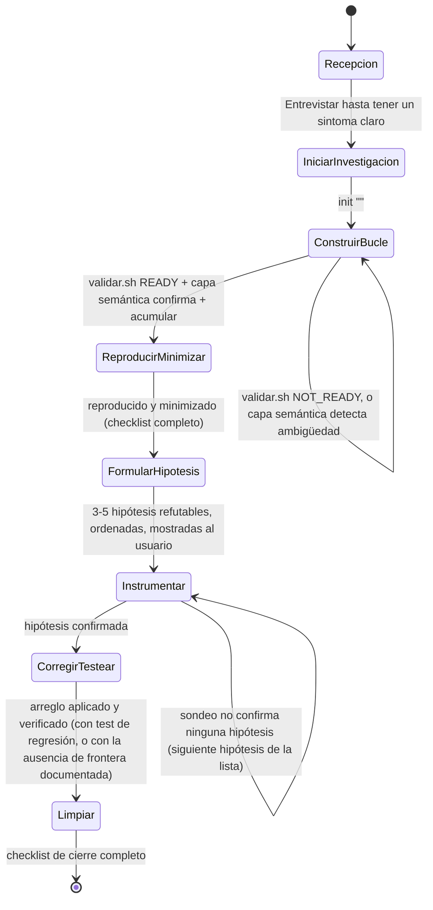

# Máquina de estados

Cada fase de `SKILL.md` es un estado. El estado persistido de una
investigación vive en su `DIAGNOSTICO.md` (`estado.sh dir <id>`): cada
sección `## <titulo>` acumulada ahí es una fase ya cerrada, así que el
estado actual de una investigación es siempre "la fase siguiente a la
última acumulada" — sobrevive a que se corte la sesión o se comprima el
contexto, porque no depende de la conversación.

## Diagrama

## Estados

| # | Fase | Entra cuando | Sale cuando (criterio de cierre) |
| - | --- | --- | --- |
| 0 | Recepción | Llega una descripción de bug | Hay un síntoma claro y accionable (entrevistado si hacía falta) |
| 1 | Iniciar investigación | Recepción cerró con un síntoma claro | `estado.sh init "<sintoma>"` devolvió un `<id>` (ej. `INV007`) |
| 2 | Construir bucle de feedback | Hay un `<id>` de una investigación nueva | `validar.sh` imprime `READY` **y** la capa semántica confirma que el bucle reproduce el síntoma exacto **y** se corrió `acumular` |
| 3 | Reproducir y minimizar | Fase 2 cerrada | El bucle reproduce el modo de falla del usuario y está reducido al escenario mínimo que sigue en rojo |
| 4 | Formular hipótesis | Fase 3 cerrada | 3 a 5 hipótesis refutables, ordenadas, mostradas al usuario (checkpoint no bloqueante) |
| 5 | Instrumentar | Fase 4 cerrada | Un sondeo confirma o descarta la hipótesis en curso — si la descarta, se vuelve a este mismo estado con la siguiente hipótesis de la lista |
| 6 | Corregir y testear | Una hipótesis quedó confirmada | Arreglo aplicado y verificado: con test de regresión en una frontera correcta, o con la ausencia de esa frontera documentada como hallazgo |
| 7 | Limpiar | Fase 6 cerrada | Checklist completo: reproducción original ya no ocurre, test de regresión (o su ausencia documentada), instrumentación `[DEBUG-...]` eliminada, prototipos descartables eliminados o movidos, hipótesis correcta en el commit/PR |

## Transiciones no lineales

- **Fase 2 tiene un sub-loop propio.** `validar.sh` puede devolver
  `NOT_READY` cualquier cantidad de veces; se ajusta el `state.md` y se
  vuelve a correr hasta `READY`. La capa semántica (manual, ver
  `fases/construir-bucle/INSTRUCCIONES.md`) es un segundo gate después de
  `READY`, antes de poder acumular.
- **Fase 5 puede volver sobre sí misma.** Si el sondeo no confirma la
  hipótesis en curso, se prueba la siguiente de la lista generada en Fase
  4 — no se retrocede a Fase 4 a menos que las 3-5 hipótesis originales se
  agoten sin confirmar ninguna.
- **Fase 6 tiene una rama sin salida distinta, pero converge igual.** Si
  no existe una frontera correcta para el test de regresión, esa ausencia
  se documenta como hallazgo — no bloquea el avance a Fase 7, que ya
  contempla ese caso en su checklist.

## Regla general

No se omite una fase sin justificación explícita, y no se avanza a la
siguiente sin cumplir el criterio de cierre de la actual (`SKILL.md`).
