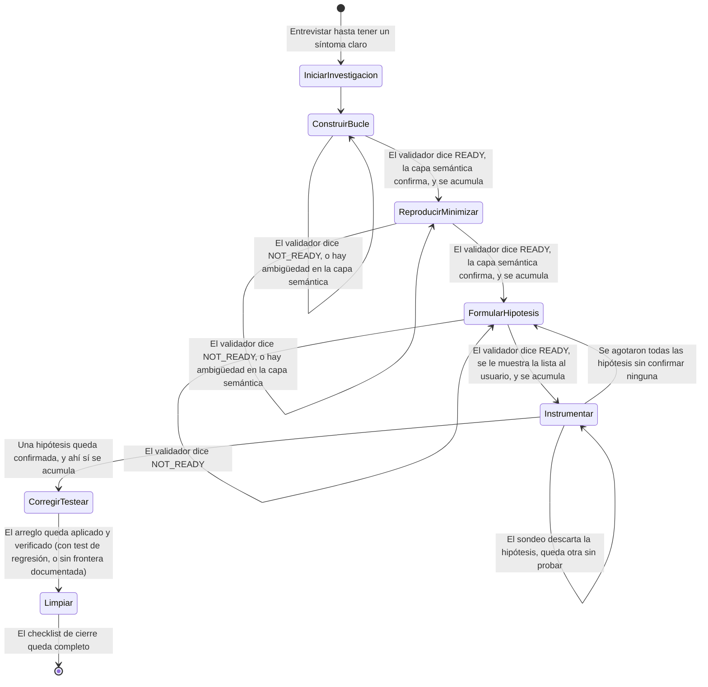

# Máquina de estados

Cada fase de `SKILL.md` es un estado. El estado persistido de una
investigación vive en su `DIAGNOSTICO.md` (`estado.sh dir <id>`): cada
sección `## <titulo>` acumulada ahí es una fase ya cerrada, así que el
estado actual de una investigación es siempre "la fase siguiente a la
última acumulada" — sobrevive a que se corte la sesión o se comprima el
contexto, porque no depende de la conversación.

## Diagrama

## Estados

| # | Fase | Entra cuando | Sale cuando (criterio de cierre) |
| - | --- | --- | --- |
| 0 | Iniciar investigación | Llega una descripción de bug | `estado.sh init "<sintoma>"` devolvió un `<id>` (ej. `INV007`) — entrevistado primero si hacía falta |
| 1 | Construir bucle de feedback | Hay un `<id>` de una investigación nueva | `validar.sh` imprime `READY` **y** la capa semántica confirma que el bucle reproduce el síntoma exacto **y** se corrió `acumular` |
| 2 | Reproducir y minimizar | Fase 1 cerrada | `validar.sh` imprime `READY` **y** la capa semántica confirma que `COMANDO_MINIMIZADO` reproduce el síntoma exacto **y** se corrió `acumular` |
| 3 | Formular hipótesis | Fase 2 cerrada, o Fase 4 agotó su ronda de hipótesis sin confirmar ninguna | `validar.sh` imprime `READY` (completitud y formato refutable) **y** se corrió `acumular-hipotesis` — mostrarle la lista al usuario es un checkpoint no bloqueante, no un gate. Puede cerrarse más de una vez por investigación (una por ronda); a partir de la segunda, `acumular-hipotesis` fusiona los registros nuevos en la misma sección de `DIAGNOSTICO.md` en vez de crear una sección aparte |
| 4 | Instrumentar | Fase 3 cerrada | Una hipótesis queda `confirmada` **y** se corrió `acumular` — es la única condición de cierre real. Mientras tanto, el loop de probar y descartar hipótesis vive en el archivo de la fase sin acumularse (nada que cerrar todavía); si se agotan todas sin confirmar ninguna, vuelve a la Fase 3 en vez de cerrar |
| 5 | Corregir y testear | Una hipótesis quedó confirmada | Arreglo aplicado y verificado: con test de regresión en una frontera correcta, o con la ausencia de esa frontera documentada como hallazgo |
| 6 | Limpiar | Fase 5 cerrada | Checklist completo: reproducción original ya no ocurre, test de regresión (o su ausencia documentada), instrumentación `[DEBUG-...]` eliminada, prototipos descartables eliminados o movidos, hipótesis correcta en el commit/PR |

## Transiciones no lineales

- **Fases 1, 2 y 3 tienen un sub-loop propio.** Sus `validar.sh` pueden
  devolver `NOT_READY` cualquier cantidad de veces; se ajusta el archivo
  de la fase y se vuelve a correr hasta `READY`. En las Fases 1 y 2, la
  capa semántica (manual, ver `fases/construir-bucle/INSTRUCCIONES.md` y
  `fases/reproducir-minimizar/INSTRUCCIONES.md`) es un segundo gate
  después de `READY`, antes de poder acumular. La Fase 3 no tiene ese
  segundo gate: mostrarle la lista al usuario es un checkpoint no
  bloqueante (ver `fases/formular-hipotesis/INSTRUCCIONES.md`), no algo
  que haya que confirmar antes de acumular.
- **Fases 3 y 4 forman un ciclo, no una secuencia estrictamente
  lineal.** Cada hipótesis tiene un ID global (`H01`, `H02`, ...) que
  nunca se repite en toda la investigación — ver
  `estado.sh proximo-id-hipotesis`. Instrumentar prueba las hipótesis
  de a una, sin acumular nada, hasta que una se confirma (ahí sí
  acumula, una única vez) o se agotan todas sin confirmar ninguna. En
  ese último caso vuelve a la Fase 3, que genera una ronda nueva con
  IDs que siguen numerando para adelante (nunca repite una hipótesis
  ya descartada) y la fusiona, con `acumular-hipotesis`, dentro de la
  misma sección `## Fase: Formular hipótesis` ya existente en
  `DIAGNOSTICO.md` — a diferencia del `acumular` genérico de las
  demás fases, no crea una sección nueva por ronda. El archivo de
  Instrumentar nunca se pierde entre rondas: cada vez que se retoma,
  suma los bloques de las hipótesis nuevas sin tocar los ya probados.
- **Fase 5 tiene una rama sin salida distinta, pero converge igual.** Si
  no existe una frontera correcta para el test de regresión, esa ausencia
  se documenta como hallazgo — no bloquea el avance a Fase 6, que ya
  contempla ese caso en su checklist.

## Regla general

No se omite una fase sin justificación explícita, y no se avanza a la
siguiente sin cumplir el criterio de cierre de la actual (`SKILL.md`).
